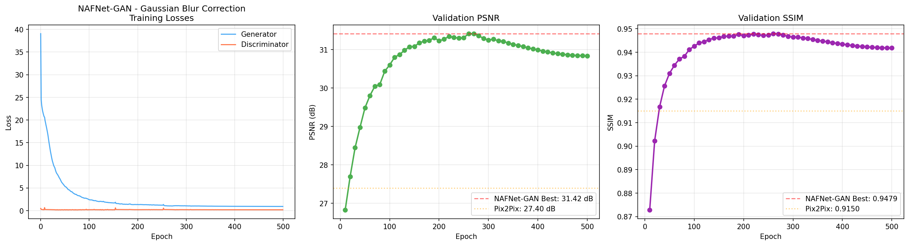
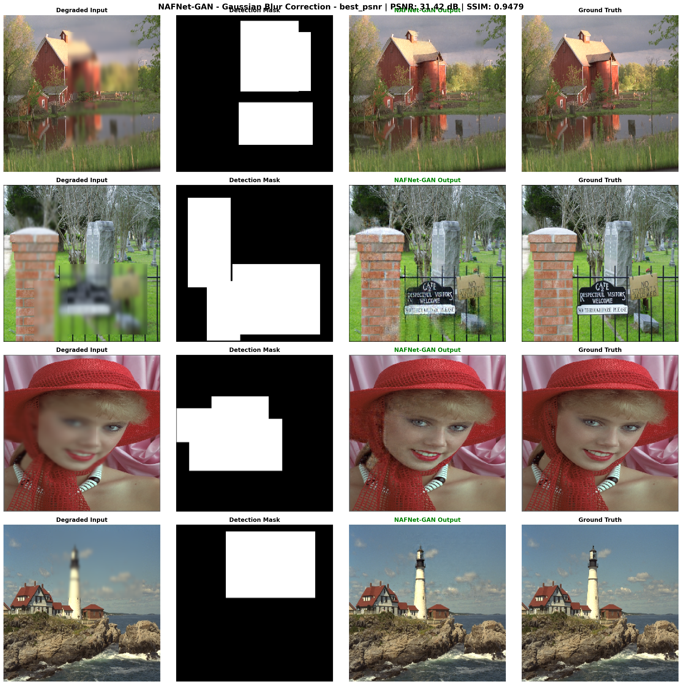

# NAFNet-GAN: Hybrid Deep Learning for Video Compression Artifact Restoration

A hybrid deep learning architecture combining **NAFNet** (Nonlinear Activation Free Network) as the generator with a **PatchGAN** discriminator for region-aware video compression artifact correction.

## 🏆 Key Results

| Method | PSNR (dB) | SSIM | Type |
|--------|:---------:|:----:|------|
| Classical Methods | 23–27 | ~0.85 | Traditional |
| Pix2Pix GAN | 27.40 | 0.9150 | GAN-based |
| **NAFNet-GAN (Ours)** | **31.42** | **0.9479** | **Hybrid** |

> **+4 dB improvement** over Pix2Pix GAN and **+6 dB** over classical methods for Gaussian blur correction.

## 📐 Architecture

```
                    ┌──────────────────────┐
  Degraded Image    │                      │
  (3ch RGB)    ───► │   NAFNet Generator   │ ───► Restored Image (3ch)
  + Binary Mask     │   (U-Net style with  │
  (1ch)             │    NAFBlocks)         │
                    └──────────────────────┘
                              │
                              ▼
                    ┌──────────────────────┐
                    │  PatchGAN            │
  Ground Truth ───► │  Discriminator       │ ───► Real / Fake
                    │  (70×70 patches)     │
                    └──────────────────────┘
```

### Combined Loss Function

```
L_total = λ_L1 × L1 + λ_SSIM × (1 - SSIM) + λ_GAN × L_GAN

Where:
  λ_L1   = 100.0  (pixel accuracy)
  λ_SSIM = 100.0  (structural quality)
  λ_GAN  = 0.5    (adversarial sharpness)
```

- **L1 Loss**: Ensures pixel-level accuracy
- **SSIM Loss**: Preserves structural quality (edges, textures)
- **GAN Loss (LSGAN/MSE)**: Adds perceptual sharpness without instability

## 🧠 Why NAFNet-GAN?

| Component | Benefit |
|-----------|---------|
| **NAFNet Generator** | Superior to U-Net — uses SimpleGate activation, channel attention, and residual learning |
| **PatchGAN Discriminator** | Classifies 70×70 image patches as real/fake — adds local sharpness |
| **Region-Aware (Mask Input)** | 4-channel input (RGB + binary mask) tells the model *where* artifacts are |
| **SSIM Loss** | Critical for structural artifacts (blur, blocking) — outperforms L1-only training |
| **LSGAN** | More stable than BCE — provides gradient signal even when discriminator is confident |

## 📊 Training Results

### Gaussian Blur Correction





**Best checkpoint at epoch 260** — PSNR: 31.42 dB, SSIM: 0.9479

## 🚀 Quick Start

### Prerequisites
- Python 3.8+
- PyTorch 1.12+
- CUDA GPU (training) / CPU (inference)
- OpenCV, NumPy, Matplotlib

### Training on Kaggle

1. Upload the training notebook to [Kaggle](https://www.kaggle.com)
2. Add the blur/noise/blocking dataset as input
3. Run [Step 1] to generate degraded image + mask pairs
4. Run the NAFNet-GAN training notebook

```python
# Key hyperparameters
IMAGE_SIZE = 256
BATCH_SIZE = 4
NUM_EPOCHS = 500
LR_GENERATOR = 1e-4
LR_DISCRIMINATOR = 1e-4
LAMBDA_L1 = 100.0
LAMBDA_SSIM = 100.0
LAMBDA_GAN = 0.5
```

## 📁 Repository Structure

```
nafnet-gan-restoration/
├── README.md
├── NAFNet_GAN_Hybrid.py          # Standalone training script
├── notebooks/
│   └── NAFNet_GAN_Blur_Training.ipynb   # Kaggle training notebook
├── results/
│   └── blur/
│       ├── training_history.png
│       └── comparison_grid_best_psnr.png
└── .gitignore
```

## 🔬 Technical Details

### NAFNet Generator
- **Input**: 4 channels (3ch RGB + 1ch binary mask)
- **Architecture**: Encoder-Decoder with skip connections
- **Blocks**: NAFBlock with SimpleGate, Channel Attention (SCA), LayerNorm2d
- **Encoder**: [2, 2, 4, 8] blocks at increasing widths
- **Middle**: 12 NAFBlocks at bottleneck
- **Decoder**: [2, 2, 2, 2] blocks with PixelShuffle upsampling
- **Residual Learning**: Output = Input_RGB + Learned_Correction

### PatchGAN Discriminator
- **Input**: 6 channels (3ch degraded RGB + 3ch output/target)
- **Architecture**: 4-layer ConvNet → 30×30 patch predictions
- **Normalization**: InstanceNorm2d
- **Activation**: LeakyReLU(0.2)

### Training Strategy
- **Optimizer G**: AdamW (lr=1e-4, weight_decay=1e-4)
- **Optimizer D**: Adam (lr=1e-4, betas=(0.5, 0.999))
- **LR Schedule**: CosineAnnealingLR (eta_min=1e-6)
- **Validation**: Every 10 epochs on 20% held-out set

## 📝 Citation

If you use this code in your research, please cite:

```bibtex
@misc{nafnet-gan-restoration,
  title={NAFNet-GAN: Hybrid Deep Learning for Video Compression Artifact Restoration},
  author={Pasindu Indrajith Weerasinghe},
  year={2025},
  url={https://github.com/PasinduIndrajith/nafnet-gan-restoration}
}
```

## 📄 License

This project is licensed under the MIT License.

## 🙏 Acknowledgments

- [NAFNet](https://github.com/megvii-research/NAFNet) — Simple Baselines for Image Restoration
- [Pix2Pix](https://phillipi.github.io/pix2pix/) — Image-to-Image Translation with Conditional Adversarial Networks
- [Kaggle](https://www.kaggle.com) — GPU compute for training
